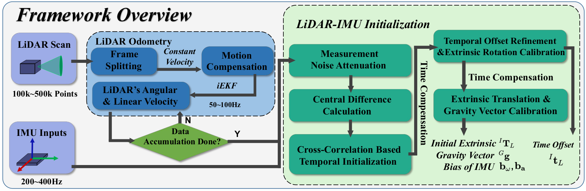
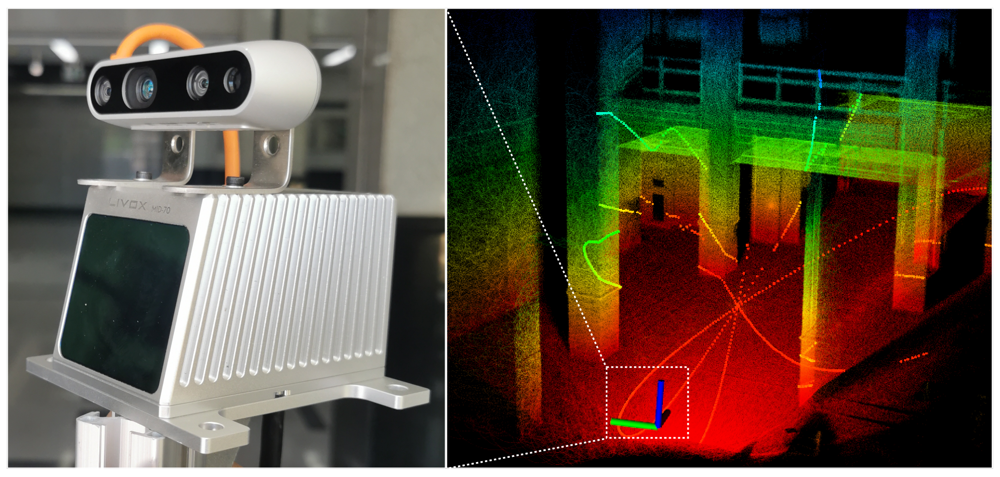

## Robust Real-time LiDAR-inertial Initialization

**LI-Init** is a robust, real-time initialization method for LiDAR-inertial system. The proposed method calibrates the temporal offset and extrinsic parameter between LiDARs and IMUs, and also the gravity vector and IMU bias. Our method does not require any target or extra sensor, specific structured environment, prior environment point map or initial values of extrinsic and time offset. Our package address following key issues:

1. A robust LiDAR odometry (**FAST-LO**) modified from FAST-LIO2.
2. Fast and robust **temporal offset and extrinsic parameter calibration** between LiDAR and IMU without any hardware setup.
3. Support **multiple LiDAR types**: both mechanical spinning LiDAR (Hesai, Velodyne, Ouster) and solid-state LiDAR ( Livox Avia/Mid360)
4. Seamlessly merged into FAST-LIO2, as a robust initialization module.

**Contributors**: [Fangcheng Zhu 朱方程](https://github.com/zfc-zfc)， [Yunfan Ren 任云帆](https://github.com/RENyunfan)， [Wei Xu 徐威](https://github.com/XW-HKU)， [Yixi Cai 蔡逸熙](https://github.com/Ecstasy-EC)

### Pipeline

<div align="center"></div>

### Excite the Sensors

<div align="center"></div>

## 1. Prerequisites

### 1.1 **Ubuntu** and **ROS**

Ubuntu >= 18.04.

ROS    >= Melodic. [ROS Installation](http://wiki.ros.org/ROS/Installation)

### 1.2. **PCL && Eigen**

PCL    >= 1.8,   Follow [PCL Installation](http://www.pointclouds.org/downloads/linux.html).

Eigen  >= 3.3.4, Follow [Eigen Installation](http://eigen.tuxfamily.org/index.php?title=Main_Page).

### 1.3. **livox_ros_driver**

Follow [livox_ros_driver Installation](https://github.com/Livox-SDK/livox_ros_driver).

###  **1.4. ceres-solver**

Our code has been tested on [ceres-solver-2.0.0](http://ceres-solver.org/installation.html#linux). Please download ceres-solver  following the instructions.

## 2. Build

```
cd ~/catkin_ws/src
git clone https://github.com/hku-mars/LiDAR_IMU_Init.git
cd ..
catkin_make -j
source devel/setup.bash
```

## 3. Run Your Own Data
```
cd realsense_ws  打开相机ROS驱动
source devel/setup.bash
source ~/imu_transformer/devel/setup.bash
roslaunch realsense2_camera rs_livox.launch 

source ~/ws_livox/devel/setup.bash   打开激光雷达ROS驱动
roslaunch livox_ros_driver livox_lidar_msg.launch

source ~/lidar_imu_init_ws/devel/setup.bash   执行标定程序
roslaunch lidar_imu_init livox_avia.launch
```
## 4. Example

<div align="center"></div>